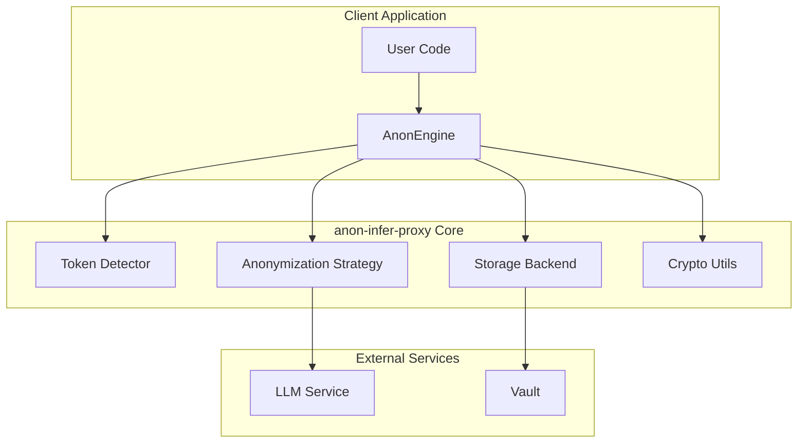
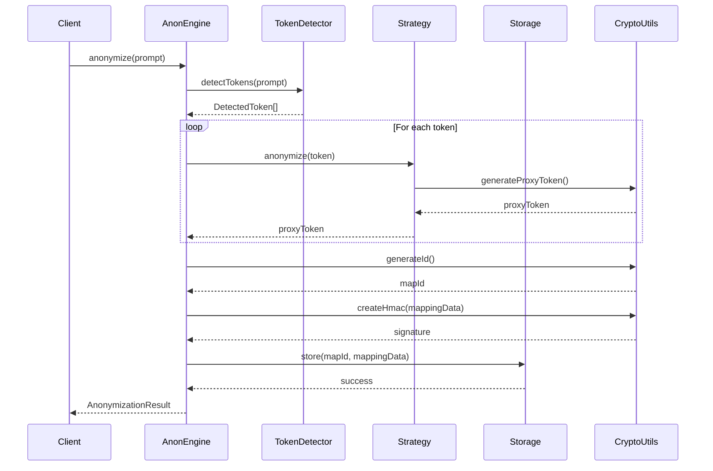
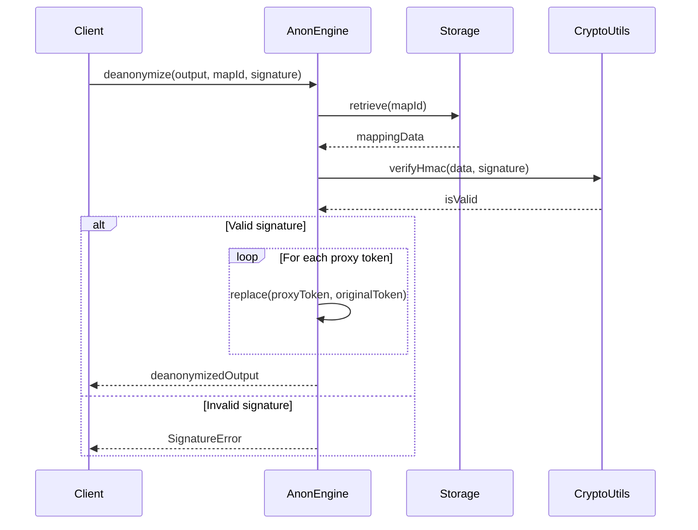
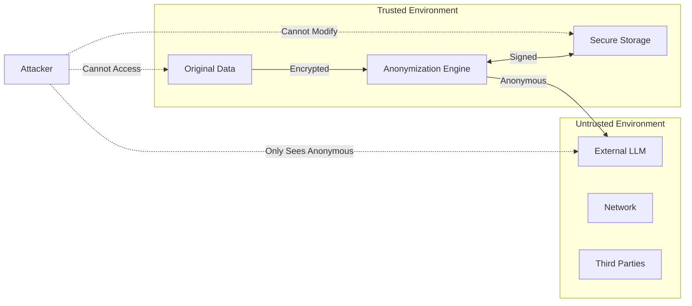
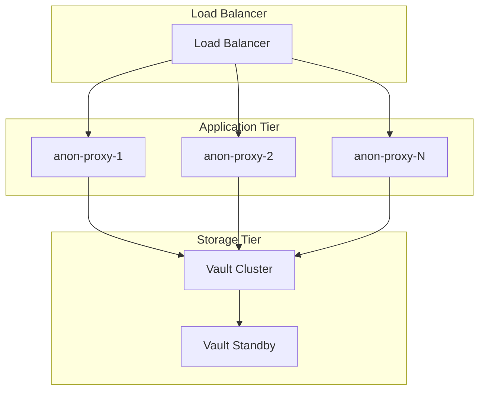
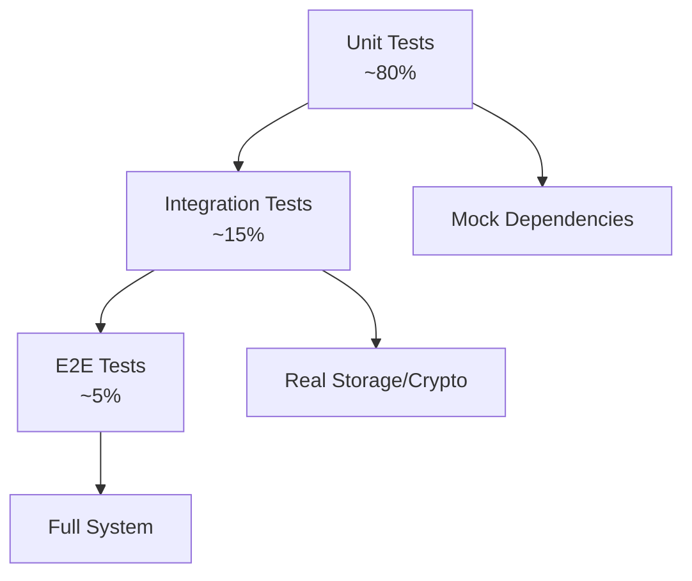

# Architecture Documentation

## Overview

`anon-infer-proxy` is designed as a modular, secure, and extensible anonymization proxy for LLM inference. This document describes the architectural decisions, patterns, and components that make up the system.

## High-Level Architecture



## Component Architecture

### 1. Core Engine (`AnonEngine`)

The `AnonEngine` is the main orchestrator that coordinates all anonymization operations.

**Responsibilities:**
- Coordinate token detection and anonymization
- Manage storage operations
- Handle cryptographic signatures
- Provide cleanup and resource management

**Design Patterns:**
- **Facade Pattern**: Simplifies complex subsystem interactions
- **Strategy Pattern**: Pluggable anonymization strategies
- **Factory Pattern**: Creates storage and strategy instances

```typescript
class AnonEngine {
  private config: AnonProxyConfig;
  private storage: StorageInterface;
  private tokenDetector: TokenDetector;
  private strategy: AnonymizationStrategyInterface;
}
```

### 2. Token Detection (`TokenDetector`)

Responsible for identifying sensitive information in text using pattern matching and entropy analysis.

**Features:**
- 15+ built-in token patterns
- Custom pattern support
- Confidence scoring
- Position tracking
- Overlap resolution

**Design Patterns:**
- **Strategy Pattern**: Different detection strategies
- **Builder Pattern**: Configuration construction
- **Observer Pattern**: Detection event notifications

```typescript
class TokenDetector {
  private config: TokenDetectionConfig;
  
  detectTokens(text: string): DetectedToken[];
  calculateConfidence(pattern: string, value: string): number;
  deduplicateTokens(tokens: DetectedToken[]): DetectedToken[];
}
```

### 3. Anonymization Strategies

#### Hash + Salt Strategy (`HashSaltStrategy`)

**Algorithm:**
1. Apply SHA-256 hash with salt
2. Generate deterministic but unpredictable proxy tokens
3. Maintain reversibility through mapping storage

**Security Properties:**
- **Deterministic**: Same input always produces same proxy
- **Collision Resistant**: SHA-256 provides strong collision resistance
- **Unpredictable**: Salt prevents rainbow table attacks
- **Reversible**: Original tokens can be restored via mapping

#### Embeddings Strategy (`EmbeddingsStrategy`)

**Algorithm:**
1. Extract semantic features from tokens
2. Generate semantic-preserving but irreversible proxies
3. Maintain utility while ensuring privacy

**Security Properties:**
- **Irreversible**: Cannot recover original tokens from proxies
- **Semantic Preservation**: Maintains context for AI understanding
- **Privacy Preserving**: No direct mapping to original data

### 4. Storage Backends

#### Memory Storage (`MemoryStorage`)

**Features:**
- In-memory Map-based storage
- TTL support for automatic cleanup
- Size limits with LRU eviction
- Fast access (sub-millisecond)

**Use Cases:**
- Development and testing
- Short-lived operations
- High-performance scenarios

#### Vault Storage (`VaultStorage`)

**Features:**
- HashiCorp Vault integration
- Encryption at rest
- Access control and auditing
- High availability and backup

**Use Cases:**
- Production environments
- Compliance requirements
- Multi-service deployments

### 5. Cryptographic Security (`CryptoUtils`)

**Components:**
- **Salt Generation**: Cryptographically secure random salts
- **Hash Functions**: SHA-256 with salt for token anonymization
- **HMAC Signatures**: Data integrity and authenticity validation
- **Constant-Time Comparison**: Timing attack prevention

**Security Algorithms:**
- **Hashing**: SHA-256
- **Signatures**: HMAC-SHA256
- **Random Generation**: crypto.randomBytes()
- **Key Derivation**: PBKDF2 (future enhancement)

## Data Flow Architecture

### Anonymization Flow



### Deanonymization Flow



## Security Architecture

### Threat Model



### Security Boundaries

1. **Trust Boundary**: Between client environment and external services
2. **Anonymization Boundary**: Where sensitive data becomes anonymous
3. **Storage Boundary**: Where mappings are securely stored
4. **Network Boundary**: Where data transits to external services

### Security Controls

| Layer | Control | Implementation |
|-------|---------|----------------|
| **Application** | Input Validation | Type checking, sanitization |
| **Cryptographic** | Data Integrity | HMAC-SHA256 signatures |
| **Storage** | Encryption at Rest | Vault backend encryption |
| **Network** | Encryption in Transit | HTTPS for all external calls |
| **Access** | Authentication | Vault token-based auth |
| **Audit** | Logging | Structured audit logs |

## Performance Architecture

### Latency Breakdown

```mermaid
gantt
    title Anonymization Operation Timeline
    dateFormat X
    axisFormat %L
    
    section Token Detection
    Pattern Matching    :0, 2
    
    section Anonymization
    Hash Computation   :2, 4
    Proxy Generation   :4, 5
    
    section Storage
    Mapping Storage    :5, 6
    
    section Signatures
    HMAC Generation    :6, 7
```



### Memory Usage Patterns

- **Static Memory**: ~10-20MB for Node.js runtime
- **Per-Operation Memory**: ~1-5KB per anonymization
- **Storage Memory**: ~1KB per mapping (memory backend)
- **Peak Memory**: Linear with concurrent operations

### Optimization Strategies

1. **Connection Pooling**: Reuse storage connections
2. **Batch Operations**: Process multiple tokens together
3. **Memory Management**: Automatic cleanup and TTL
4. **Caching**: LRU cache for frequently used patterns
5. **Lazy Loading**: Load strategies and storage on demand

## Scalability Architecture

### Horizontal Scaling



### Vertical Scaling

- **CPU**: Hash operations are CPU-intensive
- **Memory**: Storage capacity scales with mapping count
- **I/O**: Vault operations are I/O bound
- **Network**: External LLM calls are network bound

### Performance Characteristics

| Metric | Memory Backend | Vault Backend |
|--------|----------------|---------------|
| **Latency** | ~1-5ms | ~50-100ms |
| **Throughput** | 10K+ ops/sec | 100-1K ops/sec |
| **Concurrency** | High | Medium |
| **Persistence** | None | Full |
| **Consistency** | Strong | Strong |

## Extension Architecture

### Plugin System

The architecture supports multiple extension points:

1. **Custom Strategies**: Implement `AnonymizationStrategyInterface`
2. **Custom Storage**: Implement `StorageInterface`
3. **Custom Detectors**: Extend `TokenDetector` with custom patterns
4. **Custom Validators**: Add validation middleware

### Interface Design

```typescript
// Strategy Extension Point
interface AnonymizationStrategyInterface {
  anonymize(token: string, config: AnonProxyConfig): Promise<string>;
  isReversible(): boolean;
}

// Storage Extension Point
interface StorageInterface {
  store(mapId: string, mappingData: MappingData): Promise<void>;
  retrieve(mapId: string): Promise<MappingData | null>;
  delete(mapId: string): Promise<void>;
  clear(): Promise<void>;
  healthCheck(): Promise<boolean>;
}
```

## Deployment Architecture

### Container Architecture

```dockerfile
# Multi-stage build for optimal size and security
FROM node:18-alpine AS base
FROM base AS builder
FROM base AS production

# Security hardening
USER appuser
HEALTHCHECK --interval=30s CMD node healthcheck.js
```

### Service Architecture

```yaml
# Docker Compose deployment
services:
  anon-proxy:
    image: anon-infer-proxy:latest
    environment:
      - VAULT_ENDPOINT=http://vault:8200
    depends_on:
      - vault
    
  vault:
    image: vault:1.15.2
    environment:
      - VAULT_DEV_ROOT_TOKEN_ID=${VAULT_TOKEN}
```

### Monitoring Architecture

- **Health Checks**: Built-in health endpoints
- **Metrics**: Performance and security metrics
- **Logging**: Structured logging with no sensitive data
- **Alerting**: Integration with monitoring systems

## Error Handling Architecture

### Error Hierarchy

```typescript
AnonProxyError
├── ValidationError       // Input validation failures
├── StorageError          // Storage operation failures
└── SignatureError        // Cryptographic validation failures
```

### Error Recovery Strategies

1. **Graceful Degradation**: Continue with reduced functionality
2. **Circuit Breaker**: Prevent cascade failures
3. **Retry Logic**: Automatic retry with exponential backoff
4. **Fallback**: Alternative strategies when primary fails

### Error Propagation

- **User Errors**: Clear, actionable error messages
- **System Errors**: Detailed logging without sensitive data
- **Security Errors**: Minimal information disclosure

## Testing Architecture

### Test Pyramid



### Test Categories

1. **Unit Tests**: Individual component testing
2. **Integration Tests**: Component interaction testing
3. **Security Tests**: Cryptographic and security validation
4. **Performance Tests**: Latency and throughput benchmarks
5. **Chaos Tests**: Failure scenario validation

### Test Coverage

- **Code Coverage**: >95% line coverage required
- **Branch Coverage**: >90% branch coverage required
- **Security Coverage**: All crypto operations tested
- **Error Coverage**: All error paths validated

## Future Architecture Considerations

### Planned Enhancements

1. **Distributed Storage**: Multi-region storage replication
2. **Advanced Strategies**: ML-based anonymization strategies
3. **Real-time Monitoring**: Live performance dashboards
4. **Federation**: Multi-tenant support with isolation
5. **Compliance**: SOC2, GDPR, HIPAA compliance features

### Research Areas

1. **Differential Privacy**: Mathematical privacy guarantees
2. **Homomorphic Encryption**: Computation on encrypted data
3. **Zero-Knowledge Proofs**: Verification without revelation
4. **Federated Learning**: Distributed model training
5. **Quantum Resistance**: Post-quantum cryptography

This architecture provides a solid foundation for secure, scalable, and maintainable anonymization services while maintaining flexibility for future enhancements and requirements.
